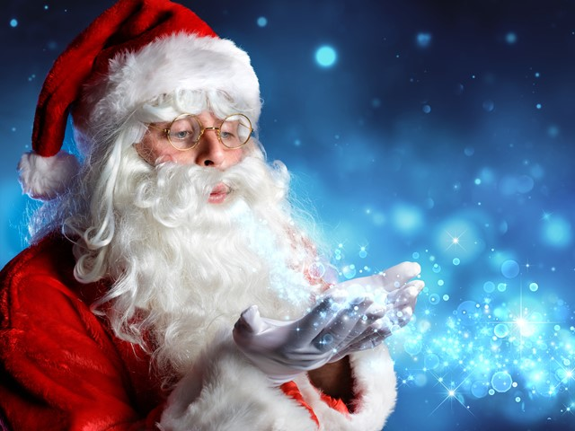
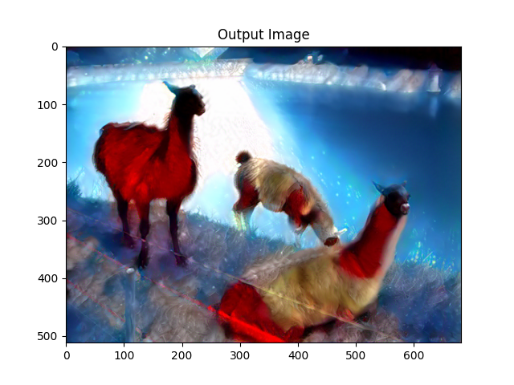

# deepdreamchristmas
***StyleGan images to make them more christmassy.*** 

This is for the RFI Christmas tree comp. 

You give an image for style and an image for content and output the style will be transfered across, i.e.

```bash
python dream_christmas.py -s .santa.jpg -c llmama.jpg 
```

## Style


## Content


## Output




## Attribution
Most of the code is just a rehash from the following pytorch tutorial: https://pytorch.org/tutorials/advanced/neural_style_tutorial.html
